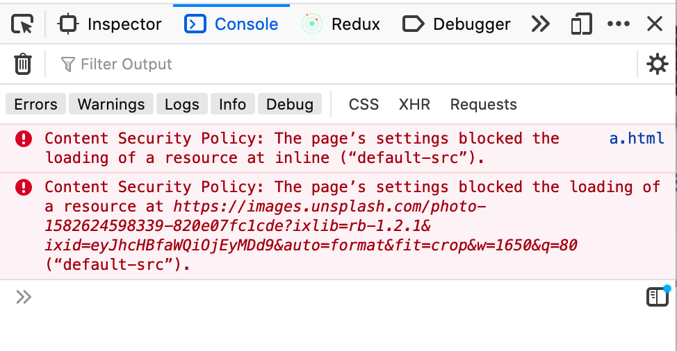

 
### Problem
It's very common while building any project we use certain third party libraries, in the case of Javascript; `npm packages`, which recursively use more packages, and eventually your code includes a huge chunk of third party code.  
There is nothing wrong with it, there is no point re-inventing the wheel. We include the required library, make our code work, write tests. Deploy to a staging environment, pass through automation and finally deploy to production.  

The problem is when a library tries to load remote content on our website. It can be an image, font, style, or even Javascript. This content bypasses all our tests, checks, and is executed directly on production. Even worse we don't know where the content is being served from.

### Content Security Policy 
`Content Security Policy` (`CSP`) is a [W3C specification](https://www.w3.org/TR/CSP3/) that helps to avoid `XSS` attacks. CSP enables developers to define rules for fetching the resources(images, javascript, fonts, etc.) on the client browser. Developers can define policies to allow/restrict loading any resource, restrict resources to load only from certain domains, and disallow from any other domain. For example, you can write a CSP to restrict browsers to load images only from `example.com`, any images from other domains will be not loaded and would throw errors. In addition to resources, CSP also offers control over the embeds.  
In the following example, the CSP forces to load images/scripts only from self domain and prevents the loading of images from other domains.


 
*From the [W3c specification](https://www.w3.org/TR/CSP3/) docs:* 
 > One of the CSP goal is to mitigate the risk of content-injection attacks by giving developers fairly granular control over
>  - The resources which can be requested (and subsequently embedded or executed) on behalf of a specific Document or Worker
>  - The execution of inline script
>  - Dynamic code execution (via eval() and similar constructs)
>  - The application of inline style

 
### How
CSP can be implemented in following two ways:
1. Specify in **HTTP headers** 
   ```TEXT
   Content-Security-Policy: __Policy__
   ```
2. Specify in **META tags** 
   ```HTML
   <meta http-equiv="Content-Security-Policy" content=" __Policy__ ">
   ```
 
#### Defining a policy
The Policy is the accumulation of directives which defines the allowed location of each resource, no directive means allowed for all. Some of the useful directives are the following:
- *default-src* : This defines the loading policy for all types of resources.
- *script-src* : This defines the loading policy for all javascript, from where javascript can be loaded.
- *img-src* : This defines the loading policy for all images, from where images can be loaded. 
 
List of directives for the other resources is [here](https://developers.google.com/web/fundamentals/security/csp#policy_applies_to_a_wide_variety_of_resources).
 
Some examples of policies are:
1. ```
   Content-Security-Policy: default-src 'self';
   ```
   This would allow resources only from the same domain, and all other resources will fail to load.
2. ```
   Content-Security-Policy: img-src example.com;
   ```
   This would allow images only from `example.com`, and all other images will fail to load.
2. ```
   Content-Security-Policy: default-src 'self'; img-src example.com;
   ```
   This would allow any resources to load only if from the same domain, except images which can be from `example.com` too.

#### Reporting
CSP also provides a way to send violation reports, in case any logging is required, via `report-uri` directive. 
```TEXT
`Content-Security-Policy: default-src 'self'; report-uri http://example.com/cspfails` 
```
 
The reports will be sent as POST request and with following JSON: 
```JSON
{
 "csp-report": {
   "document-uri": "http://example.com/",
   "referrer": "",
   "blocked-uri": "http://example.com/some_malware.js",
   "violated-directive": "default-src self",
   "original-policy": "default-src 'self'; report-uri http://example.com/cspfails"
 }
}
```
<br/>

### Risks
Before defining a CSP you should be completely aware of all the resources and respective origin required for your webapp, else some vital resources may be blocked and eventually random bugs. 
In case you are not sure what all resources are being required for running your web page smoothly, you can implement the CSP in reporting mode, in this way the violations will be reported but no resource will be blocked, once you are sure what are the resources really required, you can implement CSP. To do this instead of `Content-Security-Policy` we need to use `Content-Security-Policy-Report-Only` header. 
 
```
Content-Security-Policy-Report-Only: __Policy__ + report-uri
```
 
### Resources
- https://developer.mozilla.org/en-US/docs/Web/HTTP/CSP
- https://owasp.org/www-community/attacks/Content_Security_Policy
